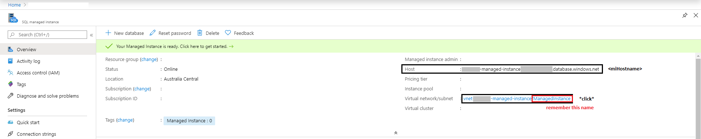
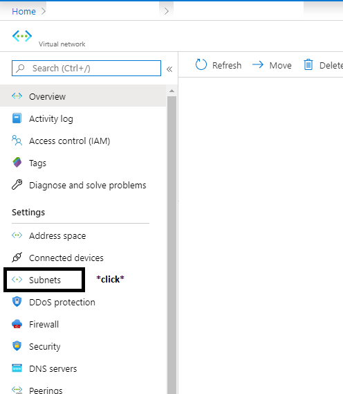
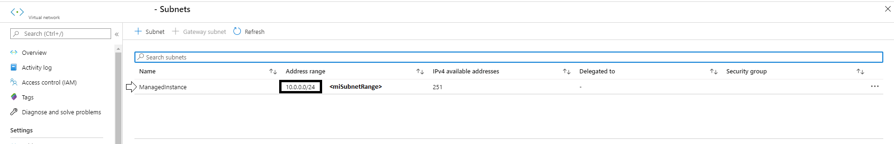

# ConnectivityTester

This is a simple tool that's used for troubleshooting Sql Managed Instance connectivity. It will do the following: 

1. Print local network configuration
2. Attempt to resolve miHostname
3. TCP ping miSubnetRange on port 1433
4. Calculate the average TCP 3-Way handshake time for successful pings for multiple connection attempts
5. TCP ping miHostname on port 3342 (this is in case user entered a hostname that resolves to a public endpoint for their Sql MI)

## Usage

`ConnectivityTester.exe <miSubnetRange> <miHostname>`

## Acquiring miSubnetRange and miHostname parameters

  
  

