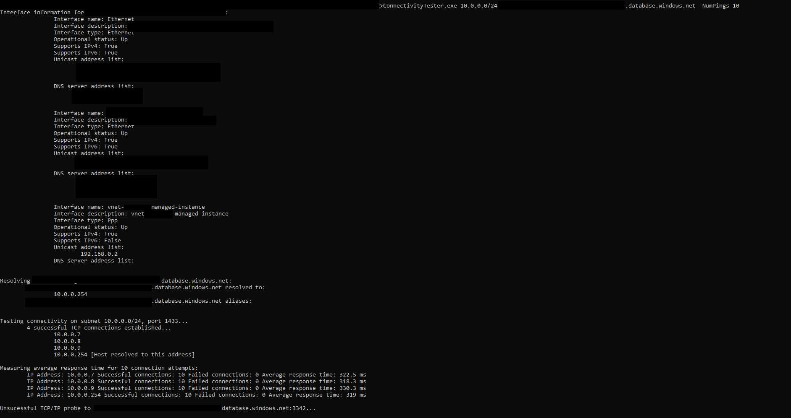

# Sql Managed Instance Connectivity Tester

This is a simple tool that's used for acquiring basic troubleshooting data in regard to Sql Managed Instance connectivity. It will perform the following on the machine it's run at: 

1. Print local network configuration
2. Attempt to resolve the hostname passed as `miHostname` command line argument
3. TCP ping the CIDR address range passed as `miSubnetRange` command line argument on port 1433
4. Calculate the average TCP 3-Way handshake time for successful pings for multiple connection attempts
5. TCP ping `miHostname` on port 3342 (this is in case user entered a hostname that resolves to a public endpoint for their Sql Managed Instance)

This tool is supposed to be used either from on premise using S2S VPN connection, from a machine using P2S VPN connection or from a Virtual Machine that's in the same VNet as Sql MI, in a peered VNet or a VNet that has VNet-VNet VPN connection to VNet in which Sql MI is located and that is expected to be reachable from the machine this tool is run at.

## Usage

`ConnectivityTester.exe <miSubnetRange> <miHostname> [-NumPings <num>]` 
* `NumPings` is an optional argument that states for how many connection attempts is the average connection setup time calculated, if not explicitly set the calculation will be done for 5 connection attempts.

## Acquiring miSubnetRange and miHostname parameters
 
  
  

 

# Output example

 

# Contributing

This project welcomes contributions and suggestions.  Most contributions require you to agree to a
Contributor License Agreement (CLA) declaring that you have the right to, and actually do, grant us
the rights to use your contribution. For details, visit https://cla.opensource.microsoft.com.

When you submit a pull request, a CLA bot will automatically determine whether you need to provide
a CLA and decorate the PR appropriately (e.g., status check, comment). Simply follow the instructions
provided by the bot. You will only need to do this once across all repos using our CLA.

This project has adopted the [Microsoft Open Source Code of Conduct](https://opensource.microsoft.com/codeofconduct/).
For more information see the [Code of Conduct FAQ](https://opensource.microsoft.com/codeofconduct/faq/) or
contact [opencode@microsoft.com](mailto:opencode@microsoft.com) with any additional questions or comments.